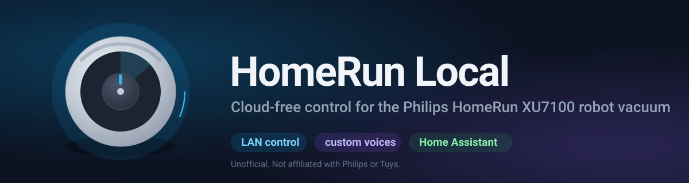
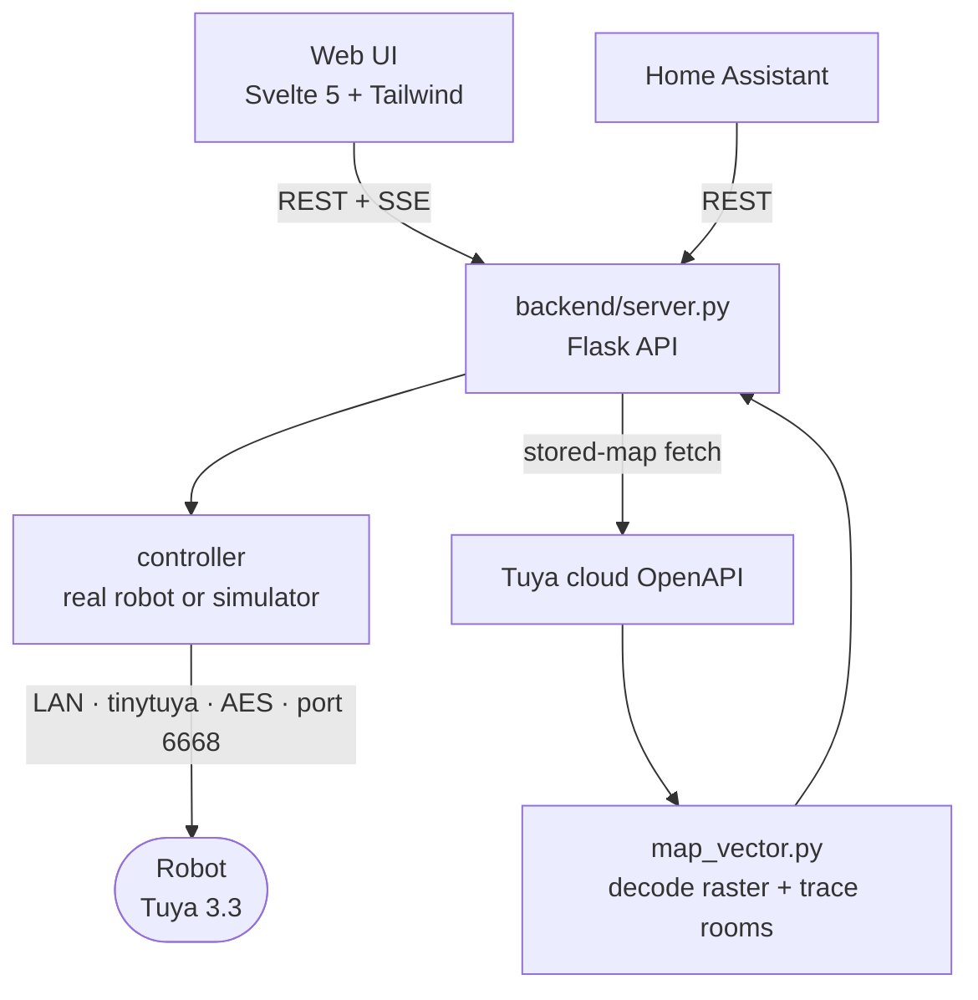

# Philips HomeRun XU7100 Local (unofficial)

> Unofficial, community-built project. Not affiliated with, endorsed by, or supported by Philips (Versuni) or Tuya. "Philips" and "HomeRun" are trademarks of their respective owners and are used here only to say which device this controls.

Local control for the Philips HomeRun XU7100 robot vacuum. It talks to the robot directly over the LAN using the Tuya protocol, so cleaning, mapping, diagnostics, and custom voice packs all work without the cloud. There is a web UI, a JSON API, and a Home Assistant integration.

## Compatibility

Built and verified on the **Philips HomeRun XU7100** (ODM name "Dustin 7100", firmware 4.6.49). It has not been tested on other units.

The rest of the Philips HomeRun line (for example the XU3000, XU5000, and XU9000 series) and other Tuya-based laser vacuums share the same protocol family, so most of this is likely to apply with some datapoint adjustments. The exact datapoint numbers and command frames were read from one specific robot, so treat them as a strong starting point rather than a guarantee for another model. Use `./homerun learn` and `./homerun sniff` to confirm the datapoints on your unit before writing to them.

## Why this exists

The robot stopped returning to its dock and got stuck on an old map. A factory reset did not help, and there was no local repair option. This project came out of reverse-engineering how it talks on the network, so it can run entirely from the LAN instead of being replaced.

The original problem turned out to be mechanical rather than a sensor fault. The full write-up is in [docs/ROOT_CAUSE.md](docs/ROOT_CAUSE.md). Short version: the dock ramp lip sat slightly proud of the floor, the bumper read it as a wall, and every failed dock made the robot think it had been kidnapped, which discarded the session map. A thin shim under the ramp fixed it.

## What it does

- **Direct LAN control.** Start, pause, stop, dock, and locate over Tuya 3.3 on port 6668. No cloud round-trip for control.
- **Live status.** State, battery, suction, water, current job, and faults, streamed to the UI over Server-Sent Events.
- **Interactive map.** The robot stores rooms as per-pixel ids with no polygons, so the map is decoded from the raster and the room outlines are traced from it. You can select rooms, set per-room suction and passes, rename, and merge.
- **Custom voice packs.** Replace any of the robot's 75 spoken prompts with custom audio, served from the host machine over the LAN. Includes a Voice Studio that writes lines, generates them with ElevenLabs, and installs the pack to the robot. Details in [docs/VOICE_PACKS.md](docs/VOICE_PACKS.md).
- **Diagnostics.** Consumable wear, lifetime totals, mode toggles, and the decoded fault bitmap.
- **Home Assistant.** A custom component under `homeassistant/` exposes the vacuum entity.
- **Simulator.** With no `local_key` configured, the whole stack runs against an in-memory robot so you can develop against it.

## How it works

The robot runs on a Tuya Linux SDK board. Control datapoints travel over the LAN as small AES-encrypted frames, which is why direct control works without the cloud. The map is the exception: laser vacuums stream maps over Tuya P2P or the cloud rather than the LAN datapoint channel, so the stored map is fetched through the Tuya cloud API and rendered locally.



Key modules:

- `backend/controller.py` maps semantic actions to Tuya datapoints, with a real backend and a simulator behind one interface.
- `backend/voice_studio.py` and `backend/custom_voice.py` build and install voice packs.
- `backend/room_overrides.py` stores your renames and merges locally, since the robot will not apply those over the LAN.
- `backend/map_vector.py` traces room outlines from the raster.
- `backend/tuya_cloud.py` signs and calls the Tuya cloud OpenAPI for the stored map.

The command protocol, datapoint map, and voice frame format are documented in [docs/COMMAND_PROTOCOL.md](docs/COMMAND_PROTOCOL.md).

## Setup

Requirements: Python 3.12, Node 22, and a Tuya IoT cloud project linked to the app account the robot is paired with.

```bash
# 1. Python deps
python3 -m venv .venv && .venv/bin/pip install -r requirements.txt

# 2. Configure
cp config.example.json config.json
#    fill in your device id, ip, and Tuya cloud client id/secret

# 3. Pull the robot's local key from your Tuya project
./getrobotkey            # runs the tinytuya wizard, writes robot_secrets.json

# 4. Build the web UI
cd web/app && npm install && npm run build && cd ../..

# 5. Run
./homerun start          # http://localhost:8787
```

With no `local_key` the server starts against the simulator, so you can try the UI before wiring up a real robot.

The `homerun` script is the entry point for everything else too: `homerun build`, `homerun cloud`, `homerun voice <folder>`, `homerun sniff`, and more. Run it with no known command to see the list.

## Home Assistant

Copy `homeassistant/custom_components/homerun_local` into your Home Assistant `custom_components` directory and point it at the backend URL. It exposes the robot as one device: a vacuum entity, a water-flow select, switches for every mode toggle, a volume number, buttons for empty-bin and mapping, sensors for battery, consumable wear and lifetime totals, and a map camera. Everything runs through the backend, so Home Assistant never contends with the web UI for the robot's single connection. Details in [homeassistant/custom_components/homerun_local/README.md](homeassistant/custom_components/homerun_local/README.md).

## Documentation

- [docs/COMMAND_PROTOCOL.md](docs/COMMAND_PROTOCOL.md) covers the datapoint map, navigation frames, and the voice frame family, verified on this robot.
- [docs/VOICE_PACKS.md](docs/VOICE_PACKS.md) covers how custom voices were reverse-engineered, the exact pack format, and the ElevenLabs Voice Studio.
- [docs/ROOT_CAUSE.md](docs/ROOT_CAUSE.md) covers the docking failure investigation.
- [docs/API_CONTRACT.md](docs/API_CONTRACT.md) covers the backend HTTP API.

## Safety and scope

This project is not affiliated with Philips or Tuya. It was built by observing traffic to and from one robot, so the datapoint numbers and command frames are specific to this model and firmware and may differ on yours. Some frames were confirmed by watching the robot move rather than from an official spec. Treat the undocumented datapoints as unsafe to write blindly, since one of them is plausibly a map reset.

Secrets stay out of the repo. `config.json`, `robot_secrets.json`, the ElevenLabs key, and the saved home map are all gitignored. Copy the `.example` files and fill in real values before running.

## License

MIT. See [LICENSE](LICENSE).
